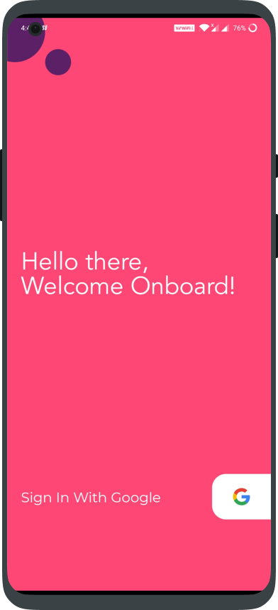

# ToDo App

   
A fully Material ToDo app with minimal features, just enough to be useful.

# Screenshots:

<!-- 

 -->

## Download
<!-- <a href="https://play.google.com/store/apps/details?id=com.avjindersinghsekhon.minimaltodo&utm_source=global_co&utm_medium=prtnr&utm_content=Mar2515&utm_campaign=PartBadge&pcampaignid=MKT-AC-global-none-all-co-pr-py-PartBadges-Oct1515-1"> -->
</a>
